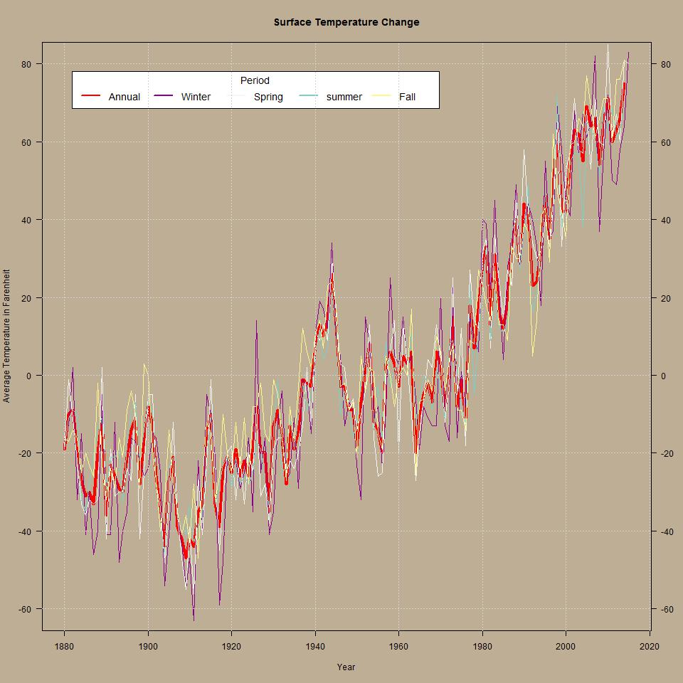
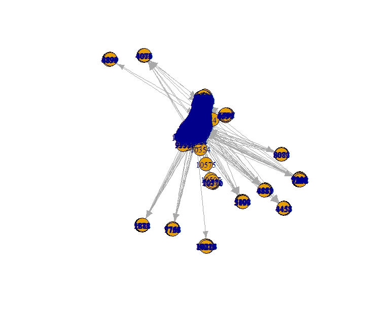
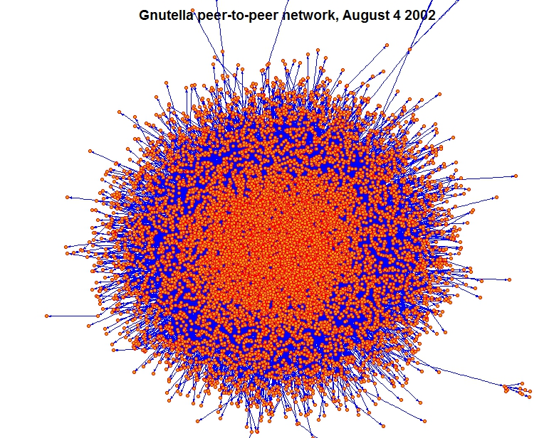
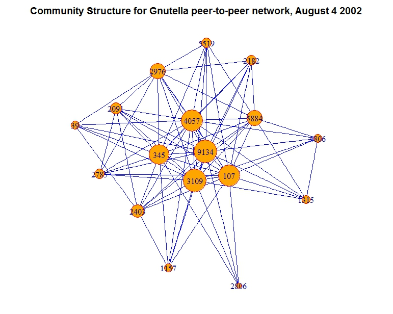

# Data Visualization Projects

## Programming Assignment 1: Visualize Data Using a Chart (From Coursera Data Visualization Course)

### Goals

1. The goal of this assignment is to give some experience with handling and deciding how to visualize some data and to get a feel for the various aspects of the visualization.
2. This assignment will also help me to analyze other visualizations and assess their effectiveness.

### Data

 The data set provided deals with world temperatures and comes from NASA:[ http://data.giss.nasa.gov/gistemp/](http://data.giss.nasa.gov/gistemp/)   
 [The origional data](https://d396qusza40orc.cloudfront.net/datavisualization/programming_assignment_1/Programming%20Assignment%20Data%20-%20GISTEMP%20Original.zip)   
 [The provided data for assignment](https://d396qusza40orc.cloudfront.net/datavisualization/programming_assignment_1/Programming%20Assignment%201%20Data%20New.zip)

### Instructions

1. Take the data from the GISTEMP site, specifically the data from “Table Data: Global and Hemispheric Monthly Means and Zonal Annual Means.” Alternatively you can use any data that you would like to explore instead.
2. Parse the data to a suitable format for the tools that you are using – we have provided two files (in JS, TXT, and CSV formats) that contain the data used to make the visualizations here, which is a subset of the data on the GISTEMP site.
3. Visualize the data in any meaningful way you wish, keeping in mind the requirements of the Programming Assignment 1 Rubric. 

### Software

The software used for this assignment is R which is a free software environment for statistical computing and graphics, available at [The R Project for Statistical Computing Website](https://www.r-project.org/)

#### Packages Used

1. plyr (For data manipulation)
2. R Base Graphics (For visualization)

### Data Preparation

The downloaded data contained 136 observations and 19 variables. The first column was the year, the second column to the thirteenth column contained the recorded average temperature for each month.  
The fourteenth column to nineteenth column were found to contain the following information:

* 14th column January-December Average Temperature
* 15th column December-November
* 16th column December-January-February (Winter)
* 17th column Spring
* 18th column summer
* 19th column Fall/Autumn    

The subset of the data containing the 1st, 14th, 16th to 19th column was created to study the behaviour of surface temperature change during the whole period of a year, Winter, Spring, Summer, and Fall/Autumn    
for the whole period between 1880 and 2015.   

### Surface Temperature Change Visualization

The subset of the data 1st,14th, 16th, 17th, 18, and 19th columns for the whole period between 1880 and 2015 contained in the dataset was used to visualize how the seasonal    
(Winter, Spring, Summer and Fall) average temperatures vary compared to the annual average temperatures. The duration between 1880 to 2015 (Year) was identified   
to be the independent variable and the seasonal average temperatures (14th, 16th to 19th columns) as dependent variables. Since time (Year) and temperature are continuous variables   
line chart was selected to visualize the data, Year(x-axis) and Average Temperatures (y-axis). From the plot it can be seen the Winter(magenta), Spring(white), Summer(Cyan)   
and Fall/Autumn(Khaki) can be compared to Annual Average Temperature(Red).

### References

1. Coursera Data Visualization Course Discussion Forums
2. Coursera Data Visualization Course Lectures
3. [The R Development Core Team, 2015: A Language and Environment for Statistical Computing](https://www.r-project.org/)
4. [A quick introduction to plyr](http://seananderson.ca/courses/12-plyr/plyr_2012.pdf)
5. GISTEMP Team, 2015: GISS Surface Temperature Analysis (GISTEMP). NASA Goddard Institute for Space Studies. Dataset accessed 20150730 at [http://data.giss.nasa.gov/gistemp/](http://data.giss.nasa.gov/gistemp/)
6. Hansen, J., R. Ruedy, M. Sato, and K. Lo, 2010: [Global surface temperature change](http://pubs.giss.nasa.gov/abs/ha00510u.html), Rev. Geophys., 48, RG4004, doi:10.1029/2010RG000345.
7. [15 Questions All R Users Have About Plots](http://www.r-bloggers.com/15-questions-all-r-users-have-about-plots/)
8. [Markdown Basics](http://rmarkdown.rstudio.com/authoring_basics.html)
9. [Colors in R](http://www.stat.columbia.edu/~tzheng/files/Rcolor.pdf)
10. [500+ Colours](http://cloford.com/resources/colours/500col.htm)
11. [A guide to using colors in R](http://www2.hawaii.edu/~bmgenco/public_files/programming_&_data_analysis_resources/R_resources/R_materials_washington_online_course/Readings/Clarkson%202010%20Guide%20to%20using%20R%20colors.pdf)
12. [Practical Rules for Using Color in Charts](http://www.perceptualedge.com/articles/visual_business_intelligence/rules_for_using_color.pdf)
13. [Table of Color](http://www.farb-tabelle.de/en/table-of-color.htm)
14. [Climate Charts & Graphs I](https://chartsgraphs.wordpress.com/r-resources/)
15. [Graphics In the R language Presentation](http://www.stat.berkeley.edu/~statcur/WorkshopBC/Presentations/Graphics/graphics.pdf)
16. [Practical Rules for Using Color in Charts](http://www.perceptualedge.com/articles/visual_business_intelligence/rules_for_using_color.pdf)
17. [Background Colors](http://www.backgroundcolor.net/)

******

## Programming Assignment 2: Visualize Network Data

### Instructions

1. Find some Network Data that you think is suitable and that you would like to visualize. Here are some sites that provide links to a wide variety of different graph/network datasets:
     + [http://snap.stanford.edu/data/index.html](http://snap.stanford.edu/data/index.html)
     + [https://networkdata.ics.uci.edu/index.php](https://networkdata.ics.uci.edu/index.php)

2. Choose a visualization platform and parse the data into a format suitable for the tools you will use.
     + For non-programmers, there are downloadable programs for creating graph visualizations at:[ http://graphviz.org](http://graphviz.org). The program "neato" is a good place to start, which creates a layout for an undirected graph based on multidimensional scaling. The main challenge with using these tools is converting the graph data into the input text file format used by the tool, and understanding (and experimenting with) the various tool settings.
     + For programmers, there are graph visualization tools available in D3 for JavaScript, such as force directed graphs, treemaps, collision detection, and a nice graph drawing tutorial. Feel free to use any other libraries or languages as well.

### Overview

This assignment is meant to give the opportunity to do non-coordinate data visualization. 

### Goals

1. To explore the means of network visualization
2. To decide how best to visualize network data, and to analyze other network visualizations.

### Data Chosen

#### [Gnutella peer-to-peer network, August 4 2002](http://snap.stanford.edu/data/p2p-Gnutella04.html)  

A sequence of snapshots of the Gnutella peer-to-peer file sharing network from August 2002. There are total of 9 snapshots of Gnutella network collected in August 2002. Nodes represent hosts in the Gnutella network topology and edges represent connections between the Gnutella hosts.

#### [Dataset statistics](http://snap.stanford.edu/data/p2p-Gnutella04.html)  

  Properties | Values
------------- | -------------
Nodes  | 10876
Edges  | 39994
Nodes in largest WCC | 10876 (1.000)
Edges in largest WCC | 39994 (1.000)
Nodes in largest SCC | 4317 (0.397)
Edges in largest SCC | 18742 (0.469)
Average clustering coefficient | 0.0062
Number of triangles	| 934
Fraction of closed triangles | 0.001807
Diameter (longest shortest path) | 9
90-percentile effective diameter | 5.4

#### Files
 
File  | Description
------------- | -------------
[p2pGnutella04.txt.gz](http://snap.stanford.edu/data/p2p-Gnutella04.txt.gz)  | Directed Gnutella P2P network from August 4 2002

### Visualization Platform

The language chosen was [**R**](https://www.r-project.org/) and the package is [**igraph**](http://igraph.org/redirect.html)

### Community Structure Visualization of Gnutella peer-to-peer network, August 4 2002

The aim is to explore the community structure of the Gnutella peer-to-peer network as on August 4 2002 in order to reveal the structure obfuscated by the amount of detail from the simple plot of the network data above.

[R Code](https://github.com/limbu-malongo/DataVis_LM/blob/master/Programming_Assignment_2%20v0.2.R)

#### Visualization of All the Nodes

#### Decorated Visualization of All the Nodes

#### Community Structure Visualization of Gnutella peer-to-peer network, August 4 2002

   
The size of the vertex is proportional to the size of the community clustered and centred at a particular node.

### References

1. Coursera Data Visualization Course Discussion Forums
2. Coursera Data Visualization Course Lectures
3. [The R Development Core Team, 2015: A Language and Environment for Statistical Computing](https://www.r-project.org/)
4. J. Leskovec, J. Kleinberg and C. Faloutsos.[Graph Evolution: Densification and Shrinking Diameters.](http://www.cs.cmu.edu/~jure/pubs/powergrowth-tkdd.pdf) ACM
Transactions on Knowledge Discovery from Data (ACM TKDD), 1(1), 2007. 
5. M. Ripeanu and I. Foster and A. Iamnitchi.[Mapping the Gnutella Network: Properties of Large-Scale Peer-to-Peer Systems and Implications for System Design.](http://snap.stanford.edu/data/p2p-Gnutella04.html) IEEE Internet Computing Journal, 2002. 
6. [Create Basic Visualizations](http://web.stanford.edu/~messing/CreateBasicNetVis.html)
7. [Social Networks in R](http://www.shizukalab.com/toolkits/sna/sna_data)
8. [Static and dynamic network visualization with R](http://kateto.net/network-visualization)
9. [Contracting and simplifying a network graph](http://blog.revolutionanalytics.com/2015/08/contracting-and-simplifying-a-network-graph.html)
10. [Community structure via short random walks](http://www.inside-r.org/packages/cran/igraph/docs/walktrap.community)
11. [Computing communities in large networks using random walks (long version)](http://arxiv.org/abs/physics/0512106)
12. [Finding Communities In Networks With R And Igraph]( http://www.sixhat.net/finding-communities-in-networks-with-r-and-igraph.html)
